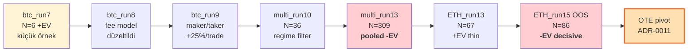
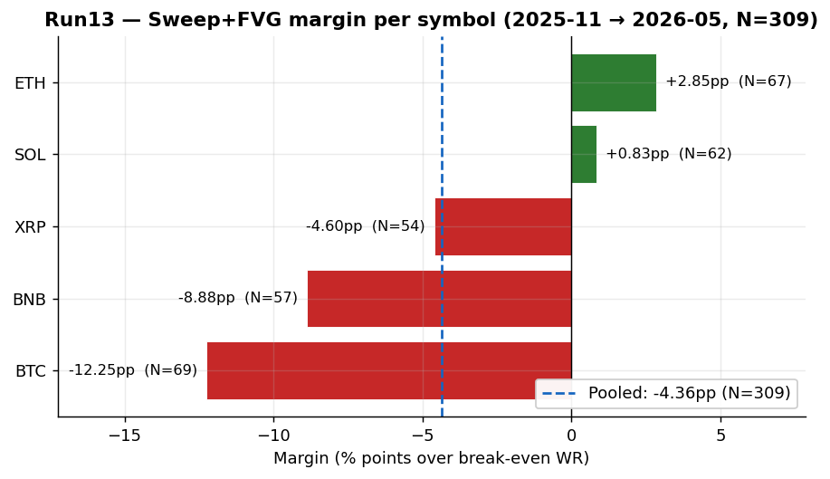
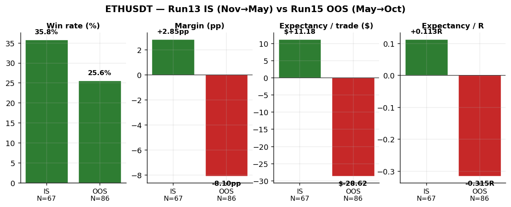
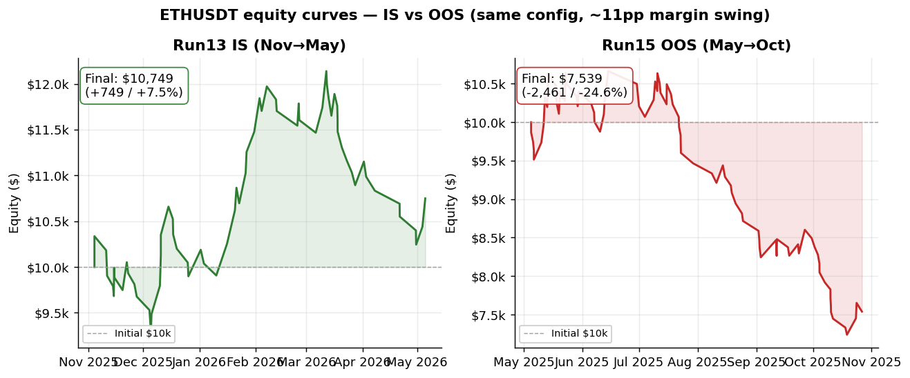
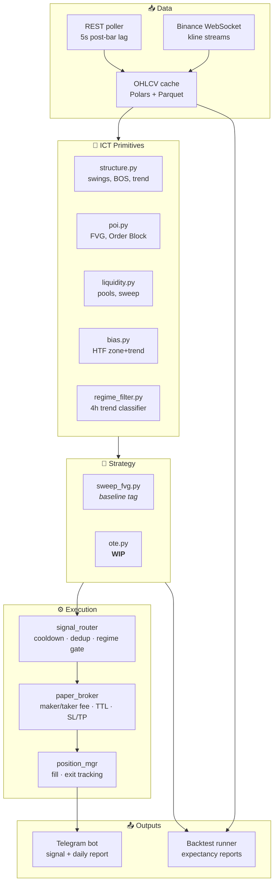

<div align="center">

# kripto_bot

**ICT (Inner Circle Trader) metodolojisiyle kripto futures için scalping sinyal botu — paper trading, edge-driven, OOS-validated.**

[](https://www.python.org/downloads/)
[](LICENSE)
[](docs/memory_bank/progress.md)
[](tests/)
[](docker/Dockerfile)

</div>

---

## Durum — Sweep+FVG invalidate, OTE'ye pivot

Bot 4 fazı tamamladı (altyapı → ICT primitives → Sweep+FVG strateji → paper engine → backtest). 14 iterasyon sonunda Sweep+FVG setup'ı bu sembol setinde **OOS'ta -EV** olarak doğrulandı — yeni strateji ailesi (**OTE**) seçildi.

> 📍 **Aktif branch:** [`feature/ote-setup`](https://github.com/isa-murat/kripto_bot/tree/feature/ote-setup)
> 📍 **Baseline tag:** [`v0.1-sweep-fvg-baseline`](https://github.com/isa-murat/kripto_bot/releases/tag/v0.1-sweep-fvg-baseline) — Sweep+FVG son hali

Detay: [progress.md](docs/memory_bank/progress.md) · [findings.md](docs/memory_bank/findings.md) · [decisions.md](docs/memory_bank/decisions.md)

---

## Backtest yolculuğu — 14 iterasyon



**Hikaye özeti:** BTC-only küçük örnek pozitifti, multi-symbol açıldığında pool -EV oldu (N=309). Tek bir sembol (ETH) thin-positive görünüyordu — out-of-sample 6 ay öncesi penceresinde test edildiğinde -24.6% return verdi. **Edge yok**, OTE'ye pivot.

### Run13 — sembol-bazlı margin dağılımı



Pool -4.36pp negatif. ETH ve SOL marjinal pozitif görünüyor ama break-even WR'ye çok yakın — sample variance dominasyonu için kırmızı bayrak.

### ETH IS vs OOS — aynı config, ~11pp swing



Aynı parametreler, sadece pencere farkı. **In-sample +2.85pp → Out-of-sample -8.10pp**. Tek pencere +EV ≠ edge.

### Equity curve — IS güzel görünüyor, OOS çöküyor



Sol: Run13 +$749 (cherry-picked window). Sağ: Run15 -$2,461 (önceki 6 ay). İki paralel pencere = real edge gerektirir; biri pozitif diğeri sert negatif = rastlantı.

---

## Key findings (F-01..F-11)

Tüm ampirik bulgular: [docs/memory_bank/findings.md](docs/memory_bank/findings.md)

| # | Bulgu | Pratik karşılık |
|---|---|---|
| **F-01** | Sweep+FVG 5 sembolde N=309 ile -EV | Bu setup'ı baseline alma |
| **F-02** | Küçük-N tuzağı — N=80'de güçlü görünen hipotez N=309'da invalidate olur | N≥200 olmadan conclusion verme |
| **F-03** | TP nearest BTC/BNB negatif, ETH/SOL pozitif (sembol asimetrik) | Volatility-aware TP zorunlu |
| **F-04** | Fee gross RR'in ~%30'unu yiyor, maker/taker ayrı modellenmeli | Net RR üstünden hedef seç |
| **F-05** | Ranging filter kayıbın ~%96.5'ini önler | Regime filter olmadan canlıya çıkma |
| **F-06** | ICT killzone crypto'da Forex'teki gibi çalışmıyor | Forex-port filtreleri default-off |
| **F-07** | XRP low-vol mean-reverter (karakter ≠ uniform) | Sembol-bazlı strateji aileleri |
| **F-08** | Weekend effect N=9 ile teyit edilmedi | Tek başına filter justification olmaz |
| **F-09** | BTC-only pozitif = single-instrument cherry-pick | Multi-symbol pooled metric kullan |
| **F-10** | Fee + ranging filter tek başına yetmiyor | Marginal improvement vs break-even, fark var |
| **F-11** | Tek window +EV ≠ edge — iki bağımsız pencere gerekli | OOS validation iki ayrı zaman penceresinde |

---

## Mimari



---

## Coin evreni

BTC · ETH · SOL · BNB · XRP — Binance USDT-M perpetual futures.
Timeframe: **1h bias → 5m entry** (4h regime gate). Detay: [ADR-0004](docs/memory_bank/decisions.md), [ADR-0008](docs/memory_bank/decisions.md).

---

## Stack

| Katman | Seçim | Niye |
|---|---|---|
| Dil | Python 3.13 | Hızlı iterasyon, geniş ekosistem |
| DataFrame | **Polars** (pandas yok) | Rust üstü, lazy execution, hızlı |
| Borsa | CCXT (REST) + Binance WS | Pivot: TR IP'den Futures WS akmıyor → REST polling ([ADR-0009](docs/memory_bank/decisions.md)) |
| Notify | python-telegram-bot | Async queue + rate limit |
| Scheduler | APScheduler + asyncio | Bar-close handler + periodic tasks |
| Config | pydantic-settings + YAML | Tip-güvenli + edit-friendly |
| Test | pytest (208/208 ✅) | Sentetik mum dizileri |
| Container | Docker + Compose Watch | Hot reload (`docker compose watch`) |
| Log | loguru | Boilerplate yok |

Rust şimdilik **yok**. Backtest profile edildi, gerçek bottleneck yok ([ADR-0003](docs/memory_bank/decisions.md)).

---

## Kurulum

İki yol var: **Docker** (önerilen, izole runtime + hot reload) veya **lokal uv** (geliştirme için).

### Docker (önerilen)

```powershell
Copy-Item .env.example .env
# notepad .env  → BINANCE_API_KEY, TELEGRAM_BOT_TOKEN, TELEGRAM_CHAT_ID

docker compose up -d --build         # build + run
docker compose logs -f               # log takip
docker compose watch                 # hot reload (src/config/scripts → sync)
```

Detay: [docs/deployment.md](docs/deployment.md)

### Lokal (uv ile)

Proje [uv](https://docs.astral.sh/uv/) ile yönetiliyor.

```powershell
uv sync --extra dev --extra backtest    # tüm bağımlılıklar
.\.venv\Scripts\Activate.ps1

Copy-Item .env.example .env             # ve doldur

python -m src.main check                # sanity check (network yok)
pytest                                  # 208 test
python -m scripts.test_telegram         # Telegram doğrulama
python -m src.data.downloader all --from 2025-11-01    # tarihsel veri
python -m src.main run                  # canlı (paper)
```

### Backtest koş

```powershell
# Tek sembol
python -m src.backtest.runner --symbol ETHUSDT --from 2025-11-01 --output data/backtest/eth.json

# Multi-symbol pooled
python scripts/multi_symbol_backtest.py --from 2025-11-01 --output-prefix run_X

# README grafiklerini yeniden üret
python scripts/generate_readme_charts.py
```

---

## Dokümantasyon

| Dosya | İçerik |
|---|---|
| [docs/PRD.md](docs/PRD.md) | Product Requirements |
| [docs/architecture.md](docs/architecture.md) | Mimari detay |
| [docs/deployment.md](docs/deployment.md) | Docker + VPS akışı |
| [docs/memory_bank/decisions.md](docs/memory_bank/decisions.md) | ADR-0001..0011 |
| [docs/memory_bank/progress.md](docs/memory_bank/progress.md) | Faz tablosu + oturum logu |
| [docs/memory_bank/findings.md](docs/memory_bank/findings.md) | F-01..F-11 ampirik bulgular |
| [docs/memory_bank/open_questions.md](docs/memory_bank/open_questions.md) | Cevap bekleyen sorular |
| [docs/memory_bank/glossary.md](docs/memory_bank/glossary.md) | ICT + proje terimleri |
| [AGENT.md](AGENT.md) | AI agent için repo talimatları |

---

## Risk uyarısı

Bu yazılım **eğitim ve araştırma amaçlıdır**. Üretilen sinyaller yatırım tavsiyesi değildir. Gerçek parayla işlem açan bir kullanım için tasarlanmamıştır — hâlihazırda canlı sistem **yalnızca paper trading** modunda çalışır ([ADR-0005](docs/memory_bank/decisions.md)). Backtest sonuçları geçmiş veriden türetilmiştir ve gelecek performansın garantisi değildir.

---

<div align="center">
<sub>Made with 🧠 + ☕ + a lot of failed backtests · MIT License</sub>
</div>
